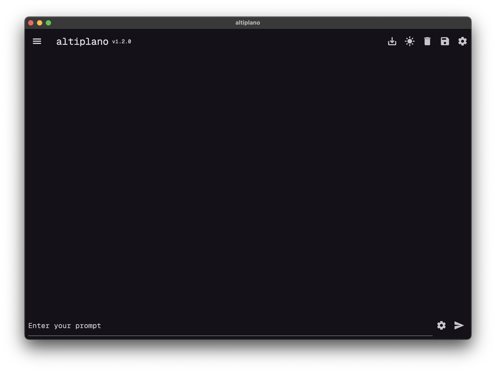

# altiplano

altiplano is a Flutter application that connects to a local Ollama instance, allowing users to interact with the Ollama API through a chat interface. Users can input prompts, send them to the Ollama model, and receive responses, all within a user-friendly interface.

## Features

- **Chat Interface**: Send prompts and receive responses from the Ollama API.
- **Input Field**: Enter prompts in the text field at the bottom of the screen.
- **Send Button**: Submit prompts to the Ollama API.
- **Export Chat**: Export the entire chat history to a JSON file.
- **Dark Mode Toggle**: Switch between light and dark themes for better visibility.
- **Settings**: Update the Ollama URL and select the model for requests.

## Requirements

- Flutter SDK (version 2.0 or higher)
- Dart SDK (version 2.12 or higher)
- A running instance of the Ollama API

## Installation

1. **Clone the repository:**
   ```bash
   git clone https://github.com/yourusername/llama_gui.git
   cd llama_gui
   ```

2. **Install dependencies:**
   Make sure you have Flutter installed on your machine. Then, run:
   ```bash
   flutter pub get
   ```

3. **Run the Ollama server:**
   Ensure that your local Ollama instance is running. The default URL used in the app is `http://127.0.0.1:11434`. Adjust this URL in the code if your server is running on a different address or port.

4. **Run the application:**
   Use the following command to run the app:
   ```bash
   flutter run
   ```

## Usage

- Open the app on your device or emulator.
- Enter a prompt in the text field at the bottom of the screen.
- Press the send button to submit the prompt to the Ollama API.
- The response from the Ollama model will be displayed in the chat area.
- Use the **Export Chat** button to save the entire chat history as a JSON file. A file picker dialog will appear, allowing you to choose the save location.
- Toggle the **Dark Mode** button to switch between light and dark themes for better visibility.

## Troubleshooting

- If you encounter a connection error, ensure that the Ollama server is running and accessible at the specified URL.
- If you are using an emulator, remember to use `10.0.2.2` instead of `127.0.0.1` to connect to your host machine's localhost.

## Contributing

Contributions are welcome! If you have suggestions for improvements or new features, feel free to open an issue or submit a pull request.

## License

This project is licensed under the MIT License.

## Acknowledgments

- [Flutter](https://flutter.dev/) - The framework used for building the app.
- [Ollama](https://ollama.com/) - The API that powers the chat functionality.